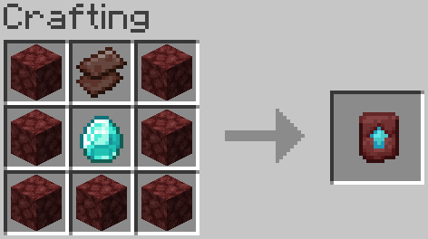

# Reusable Smithing Templates
A Minecraft: Java Edition data pack that makes smithing templates reusable and netherite upgrades easily craftable.

[Smithing templates](https://minecraft.wiki/w/Smithing_Template) are items that can be found at structures and are used to alter weapons, tools and armor on a [smithing table](https://minecraft.wiki/w/Smithing_Table). Personally, I didn't like how smithing templates would be consumed when used. It limits creativity with armor trims and makes obtaining netherite items more difficult than it needs to be. This data pack fixes this issue by returning the smithing template back to the player when it's used on a smithing table. 

Additionally, it adds a crafting recipe for the [Netherite Upgrade Smithing Template](https://minecraft.wiki/w/Netherite_Upgrade) that's much less resource intensive and doesn't require you to hunt it down in a generated structure.

This data pack does not affect the odds of finding smithing templates in generated structures. The existing duplication recipes for smithing templates are also not affected.

*Compatible with Minecraft: Java Edition version 1.20.3 - 1.20.6.*

# How to Install
## Singleplayer
### In a New World
1. Get the [latest release](https://github.com/DlljsCodes/reusable-smithing-templates/releases/latest)
2. Open Minecraft and go to Singleplayer -> Create New World -> More tab -> Data Packs -> Open Data Pack Folder
3. Drag or copy & paste the `zip` file into the window that appears
4. Click on the ▶️ right arrow on the `reusable-smithing-templates` icon, then click Done.
5. Create the world
### In an Existing World
1. Get the [latest release](https://github.com/DlljsCodes/reusable-smithing-templates/releases/latest)
2. Open Minecraft, go to Singleplayer and select the world you want to add the data pack to
3. Go to Edit -> Open World Folder
4. Open the folder named `datapacks`, and drag or copy & paste the `zip` file into the folder
5. Open the world
6. If the world was open while you added the pack and have commands enabled, run the `/reload` command or press **F3** + **T**
## Multiplayer
*These instructions may be different if you're using a third party server host. If you need help, refer to your host's support website or knowledgebase, or contact their support team.*
1. Get the [latest release](https://github.com/DlljsCodes/reusable-smithing-templates/releases/latest)
2. In your server directory, find your world folder (default: `world`)
3. Open the folder named `datapacks`, and drag or copy & paste the `zip` file into the folder
4. If the server was running while you added the pack, run the command `reload` in the server console, or `/reload` in-game as a level 3 operator

## License

This data pack is licensed under the MIT License. The license can be found [here](/LICENSE).

## Credits

* Thanks to [Misode](https://github.com/misode) for his [Data Pack Generators Website](https://misode.github.io/). Some files were made using this website.
* Special thanks to [the Minecraft Wiki](https://minecraft.wiki/) team for maintaining a high quality resource on all things Minecraft, including exhaustive documentation on data packs.
* Minecraft © 2024 Mojang AB, TM & © Microsoft Corporation.

## Contact

* Twitter: [@dlljs](https://twitter.com/dlljs)
* Discord: dlljs
* Email: [contact@dlljs.uk](mailto:contact@dlljs.uk)

NOT AN OFFICIAL MINECRAFT PRODUCT. NOT APPROVED BY OR ASSOCIATED WITH MOJANG OR MICROSOFT.